#  Solution explanation

*To be done ASAP*

#  Descrizione della soluzione

Game of life è la mia implementazione MPI del omonimo modello matematico inventato da John Conway nel 1970.  
La soluzione proposta si suddivide in cinque fasi: 

 1. I processi, in maniera distribuita, inizializzano una  matrice *NxM*: ognuno di essi inizializza *N/numero_di_processi* righe e alla fine le righe vengono inviate al processo *MASTER* attraverso l'uso di una `MPI_Gatherv`. 
 2. La matrice NxM viene suddivisa in modo equo tra tutti i processi (*MASTER* compreso) attraverso una `MPI_Scatterv`, in modo tale che ognuno di essi abbia un numero di righe pari a N diviso il numero di processi.
 3. I processi inviano in maniera asincrona la loro prima riga al loro predecessore e la loro ultima riga al loro successore e si preparano a ricevere (sempre in modo asincrono) la riga di bordo superiore (dal loro predecessore) e la riga di bordo inferiore (dal loro successore). Mentre attendono le righe di bordo, iniziano a computare l'algoritmo nelle zone della matrice in cui queste non sono coinvolte.
 4. I processi attendono l'arrivo delle righe di bordo ed eseguono le operazioni anche su quest'ultime.
 5. I risultati vengono inviati al *MASTER* attraverso l'uso di una `MPI_Gatherv`.

I punti 2, 3, 4 e 5 vengono ripetuti per un numeri *i* di volte, definito dall'utente.

## Note sulla compilazione

Per compilare non sono necessarie particolari istruzioni. Basta eseguire il comando

```
mpicc gameOfLife.c -o gof
```

Per eseguire il programma invece, basta digitare 

```
mpirun -np P ./gof -r R -c C -i I
```

Dove:
- P è il numero di processi MPI che si vuole lanciare
- R è il numero di righe della matrice (deve essere maggiore di 2)
- C è il numero di colonne della matrice (deve essere maggiore di 2)
- I è il numero di iterazioni che deve eseguire il programma 

E' possibile aggiungere al comando di prima `-v` per eseguire il programma in verbose mode. In questa modalità di esecuzione, ad ogni iterazione il programma stampa su stdout la matrice ed attende mezzo secondo prima di passare all'iterazione successiva. 

# Codice
Di seguito verrà mostrato il codice in C utilizzato per l'implementazione. La sezione verrà divisa in tre parti

 - Nella prima parte verranno descritte le funzioni che ho creato per gestire la logica di Game of life;
 - Nella seconda parte verrà presentato il codice main, spiegandone il funzionamento;
 - Nella terza parte verranno descritte le funzioni che ho creato per aiutarmi in operazioni non relative al gioco.

## Le funzioni di gioco
In questa sezione verranno mostrate le funzioni utilizzate per Game of life. Queste funzioni computano l'algoritmo, si occupano di far nascere o far morire delle celle e di tutte le altre questioni relative a Game of life.

###  born(char*)

Data in input una cella, la funzione fa si che diventi una cella viva

**Firma del metodo**

```c 
void born(char *cell);
```
**Parametri**
| Nome | Tipo | Descrizione |
|--|--|--|
| cell | char*| La cella che si vuole far nascere |

**Codice della funzione**

```c
void born(char *cell) {
    *cell = '#';
}
```
---
###  die(char*)

Data in input una cella, la funzione fa si che diventi una cella morta

**Firma del metodo**

```c 
void die(char *cell);
```
**Parametri**
| Nome | Tipo | Descrizione |
|--|--|--|
| cell | char*| La cella che si vuole far morire |

**Codice della funzione**

```c
void die(char *cell) {
    *cell = ' ';
}
```
---

###  isAlive(char)

Data in input una cella la funzione restituisce 1 se la cella è viva, 0 altrimenti

**Firma del metodo**

```c 
int isAlive(char cell);
```
**Parametri**
| Nome | Tipo | Descrizione |
|--|--|--|
| cell | char| La cella che si controllare |

**Codice della funzione**

```c
int isAlive(char cell) {
    return cell == '#';
}
```
---

###  decideFate(char*, char*, int, int)

Data in input la matrice originaria, quella di destinazione, l'indice della cella che si sta analizzando e il numero di celle vive intorno ad essa, la funzione decideFate si occupa di applicare la logica dell'algoritmo Game of life.

**Firma del metodo**

```c 
void  decideFate(char *origin_buff, char *result_buff, int index, int live_count);
```
**Parametri**
| Nome | Tipo | Descrizione |
|--|--|--|
| origin_buff | char*| Il buffer in cui si trova la cella da analizzare |
| result_buff | char*| Il buffer in cui memorizzare il nuovo stato della cella |
| index | int | L'indice della cella di cui si vuole valutare il destino |
| live_count | int | Il numero di celle vive intorno alla cella *index* di *origin_buff* |

**Codice della funzione**

```c
void decideFate(char *origin_buff, char *result_buff, int index, int live_count)
{
    if (isAlive(origin_buff[index])) {
        if (live_count < 2)
            die(&result_buff[index]);
        else if (live_count > 3)
            die(&result_buff[index]);
        else
            born(&result_buff[index]);
    }
    else  {
        if (live_count == 3)
            born(&result_buff[index]);
        else
            die(&result_buff[index]);
    }
}
```
---

###  executePrev(char*, char*, char*, int)

Data in input la matrice originaria, la riga che si trova prima della riga 0 della matrice originaria, una matrice di destinazione e il numero di colonne delle matrici, la funzione si occupa di applicare la logica di Game of life sulla riga di bordo superiore.

**Firma del metodo**

```c 
void executePrev(char* origin_buff, char* prev_row, char* result_buff, int column_size);
```
**Parametri**
| Nome | Tipo | Descrizione |
|--|--|--|
| origin_buff | char*| Il buffer che contiene la matrice originaria |
| prev_row | char*| Il buffer che contiene la riga precendente alla riga 0 di *origin_buff* |
| result_buff | char*| Il buffer che contiene la matrice di destinazione |
| column_size | int | Il numero di colonne che contiene la matrice |

**Codice della funzione**

```c
void executePrev(char* origin_buff, char* prev_row, char* result_buff, int column_size) {
    for (int j = 0; j < column_size; j++) {
        int live_count = 0;

        int col_start_index = j - 1;
        int col_end_index = j + 2;

        for (int row = -1; row < 2; row++)
            for (int col = col_start_index; col < col_end_index; col++) {
                // If I'm on the current item
                if (row == 0 && col == j)
                    continue;

                // If I want to inspect the previous row
                if (row == -1) {
                    if (isAlive(prev_row[col % column_size]))
                        live_count++;
                }
                else {
                    if (isAlive(origin_buff[row * column_size + (col % column_size)]))
                        live_count++;
                }
            }

        decideFate(origin_buff, result_buff, j, live_count);
    }
}
```
---

###  waitAndExecutePrev(MPI_Request*, char*, char*, char*, int)

La funzione attende che la richiesta venga completata e poi invoca la funzione *executePrev*

**Firma del metodo**

```c 
void waitAndExecutePrev(MPI_Request* to_wait, char* origin_buff, char* prev_row, char* result_buff, int column_size);
```
**Parametri**
| Nome | Tipo | Descrizione |
|--|--|--|
| to_wait | MPI_Request* | La richiesta da attendere |
| origin_buff | char*| Il buffer che contiene la matrice originaria |
| prev_row | char*| Il buffer che contiene la riga precendente alla riga 0 di origin_buff|
| result_buff | char*| Il buffer che contiene la matrice di destinazione |
| column_size | int | Il numero di colonne che contiene la matrice |

**Codice della funzione**

```c
void waitAndExecutePrev(MPI_Request* to_wait, char* origin_buff, char* prev_row, char* result_buff, int column_size) {
    MPI_Wait(to_wait, MPI_STATUS_IGNORE);

    executePrev(origin_buff, prev_row, result_buff, column_size);
}
```
---

###  executeNext(char*, char*, char*, int, int)

Data in input la matrice originaria, la riga che si trova dopo l'ultima riga della matrice originaria, una matrice di destinazione, il numero di righe e delle colonne delle matrici, la funzione si occupa di applicare la logica di Game of life sulla riga di bordo inferiore.

**Firma del metodo**

```c 
void executeNext(char* origin_buff, char* next_row, char* result_buff, int my_row_size, int column_size);
```
**Parametri**
| Nome | Tipo | Descrizione |
|--|--|--|
| origin_buff | char*| Il buffer che contiene la matrice originaria |
| next_row | char*| Il buffer che contiene la riga successiva all'ultima riga di *origin_buff* |
| result_buff | char*| Il buffer che contiene la matrice di destinazione |
| my_row_size | int | Il numero di righe che contiene la matrice |
| column_size | int | Il numero di colonne che contiene la matrice |

**Codice della funzione**

```c
void executeNext(char* origin_buff, char* next_row, char* result_buff, int my_row_size, int column_size) {
    for (int j = 0; j < column_size; j++) {
            int live_count = 0;

            int col_start_index = j - 1;
            int col_end_index = j + 2;

            for (int row = my_row_size - 2; row < my_row_size + 1; row++)
                for (int col = col_start_index; col < col_end_index; col++) {
                    // If I'm on the current item
                    if (row == my_row_size - 1 && col == j)
                        continue;

                    // If I want to inspect the next row
                    if (row == my_row_size) {
                        if (isAlive(next_row[col % column_size]))
                            live_count++;
                    }
                    else {
                        if (isAlive(origin_buff[row * column_size + (col % column_size)]))
                            live_count++;
                    }
                }

            decideFate(origin_buff, result_buff, (my_row_size - 1) * column_size + j, live_count);
        }
}
```
---
###  waitAndExecuteNext(MPI_Request*, char*, char*, char*, int, int)

La funzione attende che la richiesta venga completata e poi invoca la funzione *executeNext*

**Firma del metodo**

```c 
void waitAndExecuteNext(MPI_Request* to_wait, char* origin_buff, char* next_row, char* result_buff, int my_row_size, int column_size);
```
**Parametri**
| Nome | Tipo | Descrizione |
|--|--|--|
| to_wait | MPI_Request* | La richiesta da attendere |
| origin_buff | char*| Il buffer che contiene la matrice originaria |
| next_row | char*| Il buffer che contiene la riga successiva all'ultima riga di *origin_buff* |
| result_buff | char*| Il buffer che contiene la matrice di destinazione |
| my_row_size | int | Il numero di righe che contiene la matrice |
| column_size | int | Il numero di colonne che contiene la matrice |

**Codice della funzione**

```c
void waitAndExecuteNext(MPI_Request* to_wait, char* origin_buff, char* next_row, char* result_buff, int my_row_size, int column_size) {
    MPI_Wait(to_wait, MPI_STATUS_IGNORE);

    executeNext(origin_buff, next_row, result_buff, my_row_size, column_size);
}
```

## Main

In questa sezione verrà presentato, un pezzo per volta, il codice main del programma. Iniziamo con la dichiarazione delle variabili e delle MACRO.

```c
#define MASTER_NODE 0
#define MIN_SIZE 3
#define PREV_ROW_TAG 8
#define NEXT_ROW_TAG 9

int main(int argc, char **argv) {

int rank;               // Rank of the process
int world_size;         // Number of processes
double start_time;      // Indicate the starting time
double end_time;        // Indicate the ending time
int iteration_count;    // Number of steps to perform
int column_size;        // Column size
int row_size;           // Row size
int my_prev;            // The previous process
int my_next;            // The next process
int is_verbose = 0;     // If the program is in verbose mode, the program prints on stdout with small pause
                        // Warning! This impact performance! Please, do it only in testing enviroment

int *send_count;        // send_count[i] = N° elements to send at process with rank i
int *displacement;
char *receive_buff;     // Buffer used for receive the scatter from MASTER_NODE
char *prev_row;         // Buffer used to store the previous row
char *next_row;         // Buffer used to store the next row
char *result_buff;      // Buffer used to store the game computation on a node
char *game_matrix;      // The game matrix

MPI_Request send_request = MPI_REQUEST_NULL; //Request used for send data
MPI_Request prev_request = MPI_REQUEST_NULL; //Request used for receive data from the previous process
MPI_Request next_request = MPI_REQUEST_NULL; //Request used for receive data from the next process
MPI_Status status;
MPI_Datatype game_row;                       //Custom datatype that rappresent a row of the matrix's game

// Code explained later

}
```

Dopodichè inizializziamo l'ambiente MPI. Successivamente otteniamo il numero di processi (`world_size`) e il rank del processo (`rank`)

```c
// Initialize the MPI environment
MPI_Init(NULL, NULL);
// Get the number of processes
MPI_Comm_size(MPI_COMM_WORLD, &world_size);
// Get the rank of the process
MPI_Comm_rank(MPI_COMM_WORLD, &rank);
```
Procediamo quindi con il parsing degli arguments. Nel caso in cui questo dovesse fallire, interrompiamo il nostro programma dopo aver fatto visualizzare al *MASTER_NODE* su stdout come utilizzarlo.

```c
// Parsing arguments
if(!parseArgs(argc, argv, &row_size, &column_size, &iteration_count, &is_verbose)) {
    if(rank == MASTER_NODE)
        usage();

    MPI_Finalize();
    
    return 0;
}
```
Dichiaro un tipo MPI contigous personalizzato chiamato game_row. Questo tipo è composto da column_size elementi di tipo `char`. Dopo averlo dichiarato, ne eseguo il commit

```c
MPI_Type_contiguous(column_size, MPI_CHAR, &game_row);
MPI_Type_commit(&game_row);
```
Calcolo quindi il send_count ed il displacement per ogni processo. Ho deciso di dividere la matrice per righe in maniera equa. Nel caso in cui la divisione tra il numero di righe (`row_size`) e il numero di processi (`world_size`) abbia un resto *r*, allora i primi *r* processi avranno una riga in più rispetto ai restanti `world_size` - *r*.

```c
send_count = calloc(world_size, sizeof(int));
displacement = calloc(world_size, sizeof(int));
int base_offset = (int)row_size / world_size;
int rest = row_size % world_size;
int displacement_count = 0;

// Calculating dislacemennt and send_count 
for (int i = 0; i < world_size; i++) {
    displacement[i] = displacement_count;

    if (rest > 0) {
        send_count[i] = base_offset + 1;
        rest--;
    }
    else
        send_count[i] = base_offset;

    displacement_count += send_count[i];
}
```

A questo punto il processo *MASTER* inizializza la matrice e gli altri nodi iniziano a popolare le righe localmente in maniera pseudocasuale. Con una random viene generato un numero che se risulta essere pari fa si che la cella nasca, altrimenti, se dispari, la cella viene marcata come morta. Alla fine, il *MASTER* con una `MPI_Gatherv` riceve le righe dagli altri nodi e le mette nella matrice `game_matrix`

```c
// Alloc Matrix
if (rank == MASTER_NODE) {
    // Getting start time
    start_time = MPI_Wtime();

    // The game matrix is an array treated like a matrix
    game_matrix = calloc(row_size * column_size, sizeof(char));
}

// Init Matrix
result_buff = calloc(send_count[rank] * column_size, sizeof(char));
srand(time(NULL) + rank);
for(int i = 0; i < send_count[rank] * column_size; i++)
    if (rand() % 2 == 0)
        born(&result_buff[i]);
    else
        die(&result_buff[i]);

MPI_Gatherv(result_buff, send_count[rank], game_row, game_matrix, send_count, displacement, game_row, MASTER_NODE, MPI_COMM_WORLD);
```

Il problema è stato pensato per lavorare in maniera torroidale. La prima riga quindi valuterà come riga di bordo superiore l'ultima riga della matrice e, viceversa, l'ultima riga valuterà come riga di bordo inferiore la prima riga. Sulla base di questo vengono anche calcolati i predecessori e i successori del singolo processo. 
Per i predecessori:
- Se sono il processo con rank 0, il mio predecessore è `world_size` - 1
- Se sono un processo con rank diverso da 0, il predecessore è rank - 1  

Per i successori:
- Se sono il processo con rank uguale a `world_size` + 1, il muo successore è 0
- Altrimenti, il mio successore è rank + 1

```c
// Calculating my_prev and my_next
my_prev = rank == 0 ? world_size - 1 : rank - 1;
my_next = (rank + 1) == world_size ? 0 : rank + 1;
```

A questo punto inizializziamo tutti gli elementi di cui abbiamo bisogno...
```c
receive_buff = calloc(send_count[rank] * column_size, sizeof(char));
result_buff = calloc(send_count[rank] * column_size, sizeof(char));
prev_row = calloc(column_size, sizeof(char));
next_row = calloc(column_size, sizeof(char));
```

... ed iniziamo un ciclo for che si ripete per `iteration_count` volte
```c
for(int iter = 0; iter < iteration_count; iter++) {
    // Code explained later
}
```

All'interno del for, distribuiamo la matrice tra i processi attraverso una `MPI_Scatterv`. Ogni processo, successivamente, invia in maniera asincrona con una la sua prima riga al suo predecessore (che sarà la sua `next_row`) e la sua ultima riga al suo successore (che sarà la sua `prev_row`).
Ogni processo poi invoca due `MPI_IRecv` per attendere rispettivamente la `next_row` e la `prev_row`.

```c
MPI_Scatterv(game_matrix, send_count, displacement, game_row, receive_buff, send_count[rank], game_row, MASTER_NODE, MPI_COMM_WORLD);
    
int my_row_size = send_count[rank];

// Sending my first row to my prev (It will be its next_row)
MPI_Isend(receive_buff, 1, game_row, my_prev, NEXT_ROW_TAG, MPI_COMM_WORLD, &send_request);
MPI_Request_free(&send_request);

// Receiving my prev_row from my_prev
MPI_Irecv(prev_row, 1, game_row, my_prev, PREV_ROW_TAG, MPI_COMM_WORLD, &prev_request);

// Sending my last row to my next (It will be its prev_row)
MPI_Isend(receive_buff + (column_size * (my_row_size - 1)), 1, game_row, my_next, PREV_ROW_TAG, MPI_COMM_WORLD, &send_request);
MPI_Request_free(&send_request);

// Receiving my next_row from my_next
MPI_Irecv(next_row, 1, game_row, my_next, NEXT_ROW_TAG, MPI_COMM_WORLD, &next_request);
```

Mentre i processi attendono che le operazioni di invio siano completate, iniziano ad eseguire tutte le operazioni che non interagiscono con gli altri processi. In particolare scorrono tutte le righe a partire da 1 fino a `my_row_size` - 1. Per ogni cella *c*, i processi controllano se le celle intorno ad essa sono vive e in caso affermativo, viene incrementata una variabile `live_count`. Alla fine di ogni cella, ne viene valutato il destino attraverso la funzione `decide_fate()` introdotta prima.

```c
for (int i = 1; i < my_row_size - 1; i++)
    for (int j = 0; j < column_size; j++) {
        int live_count = 0;

        int col_start_index = j - 1;
        int col_end_index = j + 2;

        for (int row = i - 1; row < i + 2; row++)
            for (int col = col_start_index; col < col_end_index; col++) {
                if (row == i && col == j)
                    continue;

                if (isAlive(receive_buff[row * column_size + (col % column_size)]))
                    live_count++;
            }

        decideFate(receive_buff, result_buff, i * column_size + j, live_count);
    }
```

Una volta eseguito quanto descritto sopra, il processo resta in attesa che una delle due richieste per la riga precedente o successiva siano concluse, attraverso l'uso di una `MPI_Waitany`.

```c
//Wait for some request
MPI_Request to_wait[] = {prev_request, next_request};
int handle_index;
MPI_Waitany(
    2, // array of request's length
    to_wait, // array of requests to wait for
    &handle_index, // Index of handle for operation that completed
    &status
);
```

Se la prima richiesta ad essere completata è quella della `next_row`, il processo esegue le operazioni sull'ultima riga della sua matrice locale, si mette in attesa della `prev_row` ed esegue le operazioni sulla prima riga della sua matrice locale.
Viceversa, se la prima richiesta ed essere completata è quella della `prev_row`, il processo esegue prima le operazioni sulla prima riga della sua matrice locale, si mette in attesa della `next_row` ed esegue le operazioni sull'ultima riga della sua matrice locale.

```c
if(status.MPI_TAG == NEXT_ROW_TAG) { // If the first completed request is next_request
// perform the logic on next_row
executeNext(receive_buff, next_row, result_buff, my_row_size, column_size);
// wait for the prev_row and then perform logic
waitAndExecutePrev(&prev_request, receive_buff, prev_row, result_buff, column_size);
} else { // If the first completed request is prev_request
// perform the logic on prev_row
executePrev(receive_buff, prev_row, result_buff, column_size);
// wait for the next_row and then perform logic
waitAndExecuteNext(&next_request, receive_buff, next_row, result_buff, my_row_size, column_size);
}
```

Infine, viene eseguita una `MPI_Gatherv` per sincronizzare i risultati con il processo *MASTER*. Se è abilitata la verbose mode, il processo MASTER stampa a video la matrice ed attende mezzo secondo.

```c
MPI_Gatherv(result_buff, send_count[rank], game_row, game_matrix, send_count, displacement, game_row, MASTER_NODE, MPI_COMM_WORLD);

if(is_verbose) {
    if(rank == MASTER_NODE) {
        clearScreen();

        printf("\n\n");
        for (int i = 0; i < row_size; i++) {
            for (int j = 0; j < column_size; j++)
                printf("%c", game_matrix[i * column_size + j]);

            printf("\n");
        }
    }

    usleep(500000);
}
```

Una volte usciti dal for, si libera la memoria, si attende che tutti i processi portino a termine il lavoro, il processo *MASTER* stampa a video il tempo impiegato e si termina l'esecuzione

```c
} // End of for

    free(receive_buff);
    free(result_buff);
    free(next_row);
    free(prev_row);

    MPI_Barrier(MPI_COMM_WORLD);

    if(rank == MASTER_NODE) {
        free(game_matrix);
        end_time = MPI_Wtime();

        printf("Time taked = %f\n", end_time - start_time);
    }

    // Finalize the MPI environment.
    MPI_Finalize();

    return 0;
} // End of main
```

## Altre funzioni
In questa sezione verranno mostrate le funzioni utilizzate per semplificare operazioni quali la pulizia della console e acquisire i parametri da linea di comando

###  clearScreen()

La funzione posiziona il cursore della console in alto a sinistra in modo da poter visualizzare la nuova matrice appena generata senza vedere quella precedente.

**Firma del metodo**

```c 
void clearScreen();
```

**Codice della funzione**

```c
void clearScreen() {
  char ANSI_CLS[] = "\x1b[2J";
  char ANSI_HOME[] = "\x1b[H";
  printf("%s%s", ANSI_HOME, ANSI_CLS);
  fflush(stdout);
}
```
---

###  usage()

La funzione stampa su stdout un messaggio dove mostra il corretto utilizzo del programma

**Firma del metodo**

```c 
void usage();
```

**Codice della funzione**

```c
void usage() {
    printf("Usage: GameOfLife -r <integer_greather_then_2> -c <integer_greather_then_2> -i <positive_integer> [-v]\n\n-r, --num-row\t specify the amount of the matrix's row\n-c, --num-col\t specify the amount of the matrix's column\n-i, --iterations\tspecify the number of iterations to perform\n-v, --verbose\tIf the program is in verbose mode, the program prints on stdout with a small pause. Warning! This impact performance! Please, do it only in testing enviroment\n-h, --help\t show this message\n\n");
}
```
---
###  int parseArgs(int, char**, int*, int*, int*, int*)

La funzione consente di prelevare gli argomenti passati su riga di comando. Se gli arguments richiesti ci sono tutti e sono in formato corretto restituisce 1, 0 altrimenti.

**Firma del metodo**

```c 
int parseArgs(int argc, char** argv, int* row, int* col, int* iterations, int* verbose);
```

**Codice della funzione**

```c
int parseArgs(int argc, char** argv, int* row, int* col, int* iterations, int* verbose) {
    int opt, opt_index;

    static struct option options[] = {
        {"num-row", required_argument, 0, 'r'},
        {"num-col", required_argument, 0, 'c'},
        {"iterations", required_argument, 0, 'i'},
        {"help", no_argument, 0, 'h'},
        {"verbose", no_argument, 0, 'v'},
        {0, 0, 0, 0}
    };

    while((opt = getopt_long(argc, argv, ":r:c:i:v", options, &opt_index)) != -1)  
    {  
        switch(opt)  
        {  
            case 'i':
                *iterations = atoi(optarg);
                break;
            case 'r':
                *row = atoi(optarg);
                break;
            case 'c':
                *col = atoi(optarg);
                break;
            case 'h':
                return 0;
            case 'v':
                *verbose = 1;
                break;
            default:
                return 0;
        }
    }

    if(*row < 3 || *col < 3 || *iterations <= 0)
        return 0;

    return 1;
}
```

## Note sull'implementazione

La matrice viene allocata in maniera contingua e quindi fisicamente è un array. Tuttavia, l'array è stata trattata logicamente come una matrice, permettendo quindi il corretto funzionamento del programma. 

Attualmente il programma non supporta il caricamento di pattern da file o pattern preimpostati, si deve quindi procedere alla modifica del codice affinché i pattern vengano caricati.

### Dimostrazione della correttezza

Per dimostrare che il programma funziona correttamente, è stato fatto in modo che la matrice non fosse inizializzata in maniera pseudocasuale, ma bensì secondo il noto pattern *pulsar*.

<center></center>

Fissato un numero di iterazioni *I* pari a 10, un numero di righe *R* e un numero di colonne *C* pari a 24 e si è fatto eseguire il programma sia su un algoritmo sequenziale e sia su un algoritmo parallelo con 2 e 5 processi. 

| Sequenziale | 2 processi | 5 processi |
| --- | --- | --- |
| 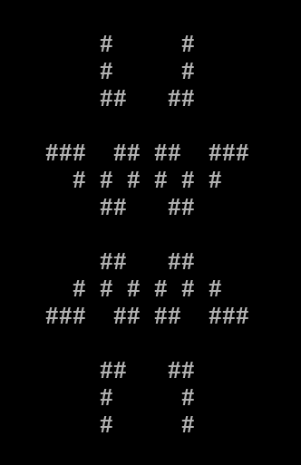 | 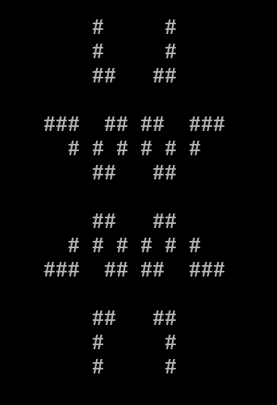 |  |

Come si può notare, tutte le matrici dopo *I = 10* steps producono lo stesso risultato. 

# Valutazione delle prestazioni

Le prestazioni sono state valutate su un cluster AWS di m4.xlarge. Le prestazioni sono state valutate utilizzando 2 CPU per macchina e ignorando le altre 2 VCPU. Verranno mostrati i risultati divisi in due sezioni
- Scalabilità forte
- Scalabilità debole

I risultati del test sono calcolati sulla media di 5 tentativi.

## Scalabilità forte

Per la scalabilità forte sono state utilizzati tre diversi valori di R (numero di righe) e di C (numero di colonne)

- R = C = 100
- R = C = 1000
- R = C = 5000

Il numero di iterazioni I è stato fissato a 100 per tutti e 3 i test

<center>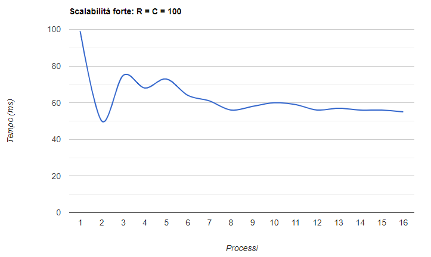</center>

Come si può notare, il comportamento con poche righe da elaborare è alquanto bizzarro. I risultati sono altanelanti e in alcuni casi si ottengono prestazioni peggiori utilizzando più nodi (4 processi *0.068s*, 5 processi processi *0.073s*). Per quanto questo porti a pensare che la soluzione non scali (o che la taglia del problema sia troppo piccola) in realtà le cose non stanno così. Questo strano comportamento mi ha portato a realizzare un esperimento che verrà presentato più avanti.

<center>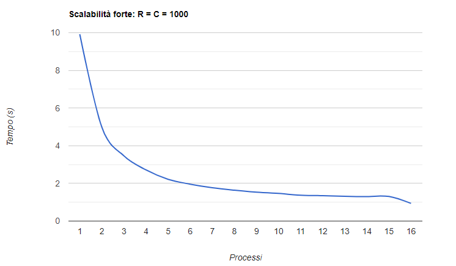</center>

Qui il comportamento è decisamente più "normale". La soluzione scala. Fino all'utilizzo di 6 processi otteniamo uno speedup quasi ottimale (5.06). Tuttavia la curva poi inizia ad appiattirsi fino ad arrivare ai 16 processi dove lo speedup si ferma a 10.58.

<center>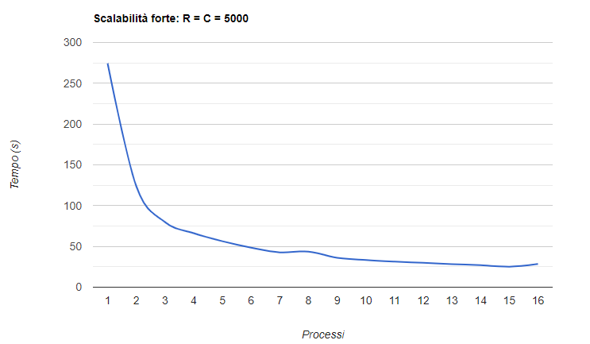</center>

Anche qui, seppur in maniera altalenante sul finale, la soluzione scala. Anche in questo caso notiamo come la curva inizi ad appiattirsi dopo il sesto processo con una piccola impennata una volta arrivati all'utilizzo di 16 processi.

#### Tabella riassuntiva *scalabilità forte*

| P | R = C = 100 | R = C = 1000 | R = C = 5000 |
| --- | --- | --- | --- |
| 1 | 0.099s | 9.917s | 274.473s |
| 2 | 0.050s | 4.975s | 123.557s |
| 3 | 0.075s | 3.461s | 79.764s |
| 4 | 0.068s | 2.713s | 66.206s |
| 5 | 0.073s | 2.216s | 56.343s |
| 6 | 0.064s | 1.958s | 48.444s |
| 7 | 0.061s | 1.769s | 42.715s |
| 8 | 0.056s | 1.638s | 43.662s |
| 9 | 0.058s | 1.534s | 36.054s |
| 10 | 0.060s | 1.469s | 33.314s |
| 11 | 0.059s | 1.368s | 31.411s |
| 12 | 0.056s | 1.348s | 29.900s |
| 13 | 0.057s | 1.313s | 28.240s |
| 14 | 0.056s | 1.298s | 27.029s |
| 15 | 0.056s | 1.307s | 25.182s |
| 16 | 0.055s | 0.937s | 28.394s |

## Scalabilità debole

Per testare la scalabilità debole ho effettuato due test. In entrambi, il numero di iterazioni I è stato impostato a 100. Nei due test sono variati il numero di colonne C e il numero di righe R. Nel primo caso:
- R è stato impostato in modo che ogni processo ne gestisse 100. Quindi con 1 processo, R = 100, con 2 processi R = 200 e così via.
- C è rimasto costante a 100.

Nel secondo caso invece:
- R è stato impostato in modo che ogni processo ne gestisse 500. Quindi con 1 processo, R = 500, con 2 processi R = 1000 e così via.
- C è rimasto costante a 500.

<center>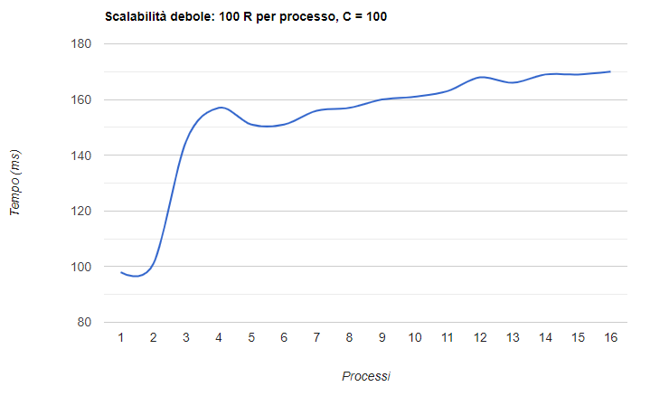</center>

Anche dal punto di vista della scalabilità debole, con taglie piccole, si ottengono risultati molto lontani da quelli desiderati sul cluster AWS.

<center>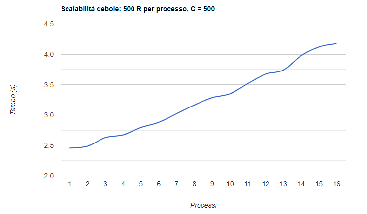</center>

Con taglie dell'input più grandi, sulla scalabilità debole si ottiene un buon risultato, anche se i tempi di esecuzione non sono del tutto lineari. 

#### Tabella riassuntiva *scalabilità debole*

| P | 100 righe per processo, C = 100 | 500 righe per processo, C = 500 |
| --- | --- | --- |
| 1 | 0.098s | 2.456s |
| 2 | 0.101s | 2.487s |
| 3 | 0.145s | 2.629s |
| 4 | 0.157s | 2.674s |
| 5 | 0.151s | 2.796s |
| 6 | 0.151s | 2.880s |
| 7 | 0.156s | 3.021s |
| 8 | 0.157s | 3.165s |
| 9 | 0.160s | 3.287s |
| 10 | 0.161s | 3.350s |
| 11 | 0.163s | 3.516s |
| 12 | 0.168s | 3.673s |
| 13 | 0.166s | 3.739s |
| 14 | 0.169s | 3.977s |
| 15 | 0.169s | 4.120s |
| 16 | 0.170s | 4.175s |


# Valutazione delle prestazioni (in locale)

I risultati ottenuti prima mi hanno lasciato alquanto perplesso (sopratutto per la scalabilità forte). E' per questo motivo che ho deciso di rieseguire gli stessi test creando un cluster locale. Per farlo ho creato un cluster composto da macchine (ahimè) non omogenee, utilizzando i pc che ho a casa i quali comunicano sempre attraverso l'utilizzo del ssh.

| Processore | Frequenza | Numero di core (fisici)|
| --- | --- | --- |
| Intel i5 4200U | @1.60 Ghz (@2.60 Ghz in turbo boost) | 2 |
| Intel Xeon X3440 | @3.60 Ghz | 4 |
| Intel i5 8600k| @3.60 Ghz (@4.30 Ghz in turbo boost)| 6 |

Avendo un numero di core limitato a 12, i risultati verranno comparati fino all'utilizzo di 12 processi.

## Scalabilità forte

<center></center>

Come viene riassunto da questo grafico, in un cluster locale, su input piccoli, non solo si ottengono prestazioni in termini di tempo, ma anche in termini di scalabilità forte.

<center>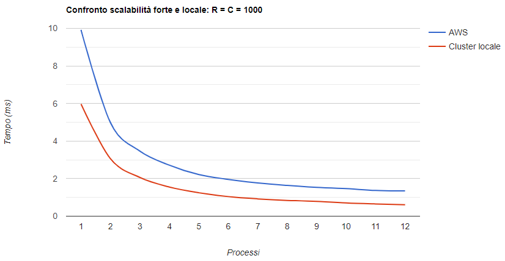</center>

<center>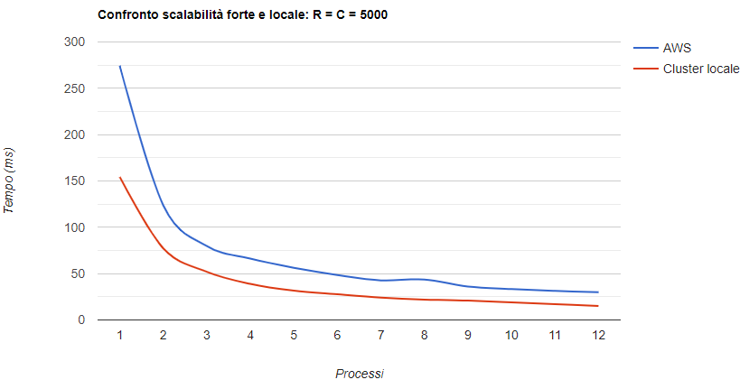</center>

Su input più grandi, invece, il comportamento dal punto di vista della scalabilità forte è simile. Questo lascia intuire qualcosa sull'overhead di comunicazione che verrà approfondito nella sezione conclusioni.

#### Tabella riassuntiva *scalabilità forte in locale*

| P | R = C = 100 | R = C = 1000 | R = C = 5000 |
| --- | --- | --- | --- |
| 1 | 0.061s | 5.965s | 154.258s |
| 2 | 0.031s | 3.055s | 77.217s |
| 3 | 0.021s | 2.062s | 51.929s |
| 4 | 0.016s | 1.551s | 38.881s |
| 5 | 0.013s | 1.246s | 31.577s |
| 6 | 0.011s | 1.043s | 27.690s |
| 7 | 0.009s | 0.921s | 24.199s |
| 8 | 0.008s | 0.839s | 21.960s |
| 9 | 0.008s | 0.791s | 20.843s |
| 10 | 0.007s | 0.704s | 19.018s |
| 11 | 0.006s | 0.651s | 17.072s |
| 12 | 0.006s | 0.611s | 15.013s |

## Scalabilità debole

<center>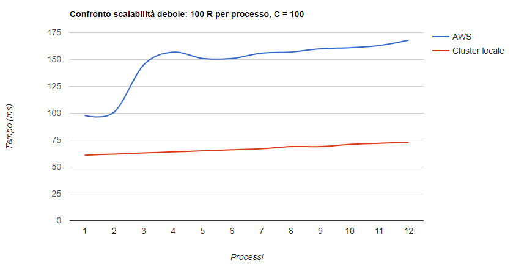</center>

<center>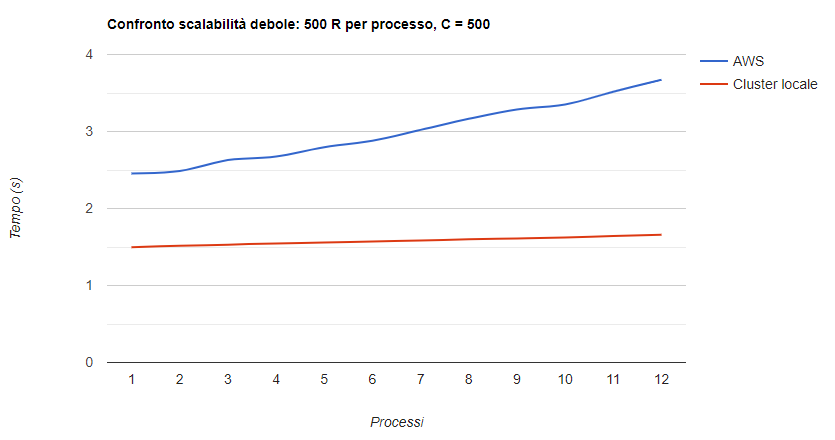</center>

Sul cluster locale si nota un netto miglioramento della scalabilità debole, la quale si avvicina molto a quella ideale.

#### Tabella riassuntiva *scalabilità debole in locale*

| P | 100 righe per processo, C = 100 | 500 righe per processo, C = 500 |
| --- | --- | --- |
| 1 | 0.061s | 1.496s |
| 2 | 0.062s | 1.516s |
| 3 | 0.063s | 1.530s |
| 4 | 0.064s | 1.547s |
| 5 | 0.065s | 1.557s |
| 6 | 0.066s | 1.572s |
| 7 | 0.067s | 1.584s |
| 8 | 0.069s | 1.601s |
| 9 | 0.069s | 1.611s |
| 10 | 0.071s | 1.623s |
| 11 | 0.072s | 1.643s |
| 12 | 0.073s | 1.658s |

## Considerazioni sullo speedup 

<center>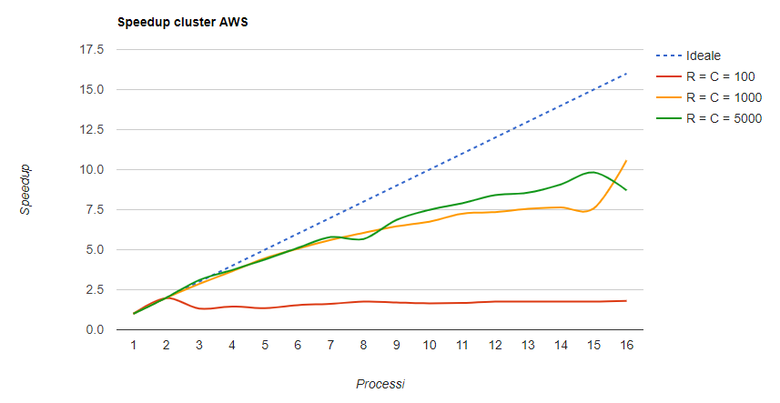</center>

Lo speedup su cluster AWS non è dei migliori. Su input piccoli i risultati sono pessimi. La situazione migliora al crescere dell'input, ma si è comunque lontani dalla linea ideale. Lo speedup più alto ottenuto è stato con 16 processi su R = C = 1000 con un punteggio di 10.58

<center>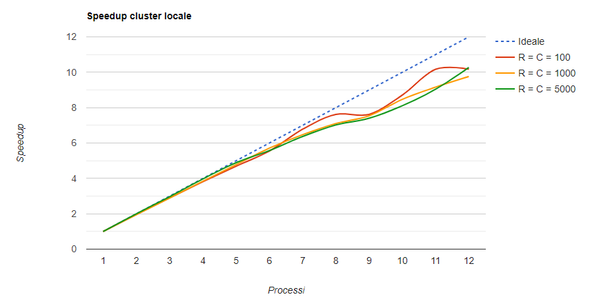</center>

Lo speedup su cluster locale ottiene risultati decisamente migliori. Si avvicina molto di più allo speed-up ideale. Lo speedup più alto ottenuto è stato con 12 processi su R = C = 5000 con un punteggio di 10.27

# Conclusioni

Da quanto si evince dai grafici riportati nelle sezioni precendenti, l'algoritmo su un cluster AWS si comporta male su valori di C e R piccoli. Questo è dovuto molto probabilmente ad un alto overhead di comunicazione dovuto principalmente alla rete. Questo è provato dal fatto che sugli esperimenti su cluster in locale l'algoritmo si comporta in maniera ottimale. Sul cluster AWS, dove i nodi non sono in locale, ma comunicano attraverso la rete, viene aggiunto quel delay che porta ad avere risultati abbastanza scarsi. Questo discorso si applica sia sulla scalabilità forte che su quella debole. 

Con valori di input molto alti, l'overhead si assottiglia, ottenendo curve abbastanza simili sia su cluster locale che su cluster AWS. 

Il variare dei tempi di esecuzione tra AWS e cluster locale è molto probabilmente dovuto al tipo di CPU che AWS assegna. Potrebbe trattarsi infatti di CPU con frequenza inferiore a quelle utilizzate nel cluster locale, con conseguente aumento dei tempi di eseucuzione. 

